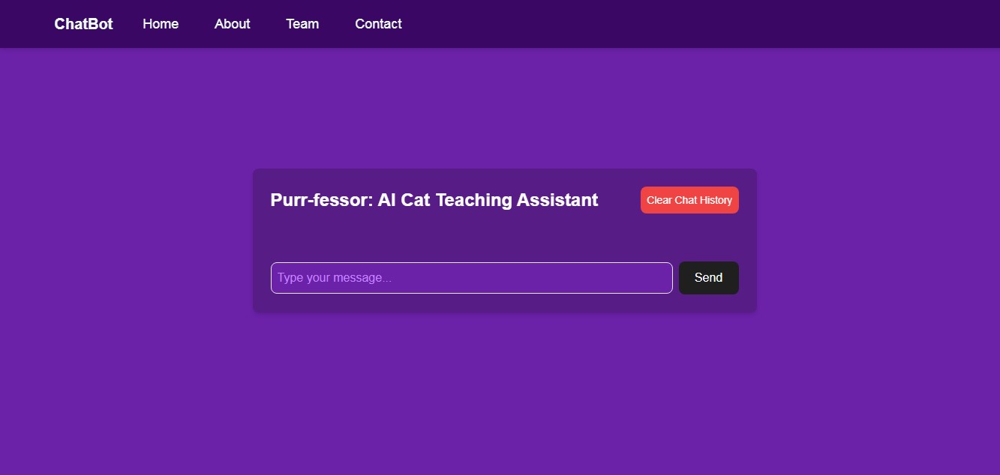

[

](https://ai-study-assistant.vercel.app)

# Purr-fessor: Your AI Cat Teaching Assistant 🐾✨

Purr-fessor is an AI-powered teaching assistant chatbot designed to make learning both fun and engaging. With its adorable feline personality, Purr-fessor brings a playful and charming twist to education, offering academic support, study tips, and constant encouragement — all with a dash of cat-inspired charisma! 🐱📚

**Theme Catchline:** "Where curiosity meets education — one paw at a time!"

## 📋 Table of Contents

- [Getting Started 🛠️](#getting-started-🛠️)
- [Key Features 🐾](#key-features-🐾)
- [Chatbot Personality Traits 😸](#chatbot-personality-traits-😸)
- [Cat-themed Elements 🐱](#cat-themed-elements-🐱)
- [Tech Stack 🖥️](#tech-stack-🖥️)
- [Features Coming Soon 🚀](#features-coming-soon-🚀)
- [Contributor 🙌](#contributor-🙌)
- [License 📜](#license-📜)

## Getting Started 🛠️

This project is built using [Next.js](https://nextjs.org/).

1. **Clone the repository:** `git clone https://github.com/shoaib2000857/TeamGChatBot.git`
2. **Install dependencies:** `npm install`
3. **Run the development server:** `npm run dev`

## Key Features 🐾

- **Meow-tivational Messages:** Sends uplifting and encouraging messages to keep students inspired.
- **Whisker-smart Answers:** Provides clear and concise explanations to academic questions, making learning a breeze.
- **Purr-sonal Study Plans:** Helps students create custom study schedules that cater to their unique needs.
- **Tail-ored Resources:** Recommends relevant materials and resources to enhance learning.
- **Feline Feedback:** Offers constructive feedback on assignments — always with a playful twist!

## Chatbot Personality Traits 😸

- **Curious and inquisitive 🧐:** Always eager to explore and learn, encouraging students to think deeply.
- **Patient and supportive 💖:** Never gets frustrated, patiently guides users through concepts, and offers encouragement.
- **Playful and witty 😸:** Uses cat-themed puns and jokes to make learning fun and engaging.
- **Knowledgeable yet approachable 🧠:** Highly knowledgeable but maintains a friendly and relatable demeanor.

## Cat-themed Elements 🐱

- **User Greeting:** “Meow there! Ready to pounce on some knowledge?” 🐾
- **Loading Message:** “Just grooming my thoughts, give me a moment...” 🐈
- **Error Message:** “Uh-oh, I got distracted by a laser pointer! Let's try again.” 😹
- **Task Completion:** “Purr-fect! You’ve mastered this concept!” 🏆🐾

## Tech Stack 🖥️

- **JavaScript:** Provides the logic and interactivity of the chatbot. It handles user input, generates responses, and manages the dynamic elements of the application.
- **Next.js:** A powerful React framework for building web applications. It simplifies development with features like server-side rendering, routing, and data fetching,
- **Axios:** A library used for making HTTP requests. It enables the chatbot to communicate with external APIs and fetch necessary data, such as information from knowledge bases or language models.
- **TailwindCSS:** A utility-first CSS framework for rapidly building custom user interfaces. It provides a wide range of pre-defined CSS classes that can be easily combined to style the application, resulting in a visually appealing and consistent design.
- **@google/generative-ai:** Google's library for accessing their generative AI models. This allows the chatbot to leverage advanced language processing capabilities, such as natural language understanding and generation, to provide intelligent and engaging responses.

## Features Coming Soon 🚀

- **Authentication 🔐:** Secure user accounts and personalized experiences.
- **Authorization 🛡️:** Control access to different features and resources based on user roles.
- **Text to Audio 🎧:** Enable users to listen to the chatbot's responses.
- **Audio to Text 🎙️:** Allow users to interact with the chatbot using voice commands.
- **Database 💾:** Store user data, conversation history, and learning progress for a more personalized experience.
- ...and more exciting updates!

## Contributor 🙌

- [Ashutosh Gaurav](https://www.linkedin.com/in/ashutosh-li)
- [SHOAIB SALEHMOHAMED](https://github.com/shoaib2000857)
- [Marmik Gajbhiye](https://github.com/Marmikgaj)
- [Tejas Vijaya](https://github.com/TejasVijaya74)

## License 📜

This project is licensed under the GNU GENERAL PUBLIC LICENSE. See the LICENSE file for details.
